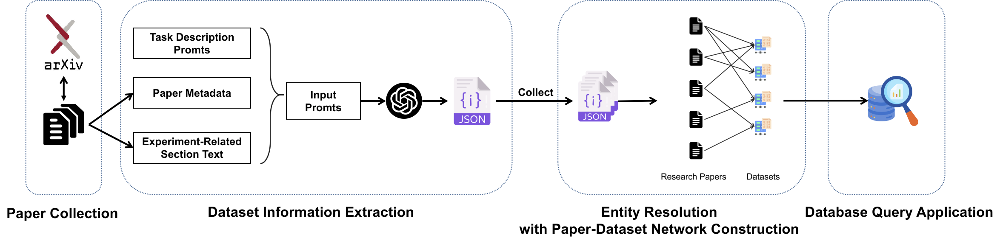

# LLM-driven System for Constructing Paper-Dataset Network

## Introduction

Leveraging Large Language Models (LLMs), our system automatically extracts dataset information from scientific papers, creating a Paper-Dataset Network. This innovative approach may offer a new pathway for discovering datasets.


## Current Features

- [X] Utilizes paper information from the arXiv dataset available on Kaggle: [arXiv Dataset](https://www.kaggle.com/datasets/Cornell-University/arxiv)
- [X] `dataset_information_extraction.py`: Automatically extracts dataset information from papers using Large Language Models.
- [X] `entity_resolution.py`: Merges entities that have different names but refer to the same dataset, building a network between papers and datasets.
- [X] `database_query_application.py`: Implements querying of the paper-dataset network information through a database application.

## Installation

```bash
git clone https://github.com/QuteComputing/LLM4PDN
cd LLM4PDN
conda env create -f environment.yml
```

## Usage Demo

Use `database_query_application.py` to query information related to the paper-dataset network.
Example:

```bash
cd src
python database_query_application.py
```

You can also use `dataset_information_extraction.py` to extract dataset information from demo papers.

Before starting this program, you need to configure the `api_key` used by the current large language model in `src/openai_api.json`.
Example:

```bash
cd src
python dataset_information_extraction.py
```

(Currently, Entity Resolution is implmented in a simple way. We will improve it in the future.)

## TODO

- [ ] Experiment with more papers.
- [ ] Improve entity resolution methods.
- [ ] Support more comprehensive query functions.
- [ ] Discover interesting applications on our system!

This project is continuously being updated. We welcome valuable feedback and suggestions. Feel free to contribute to this project and join us in its development.
